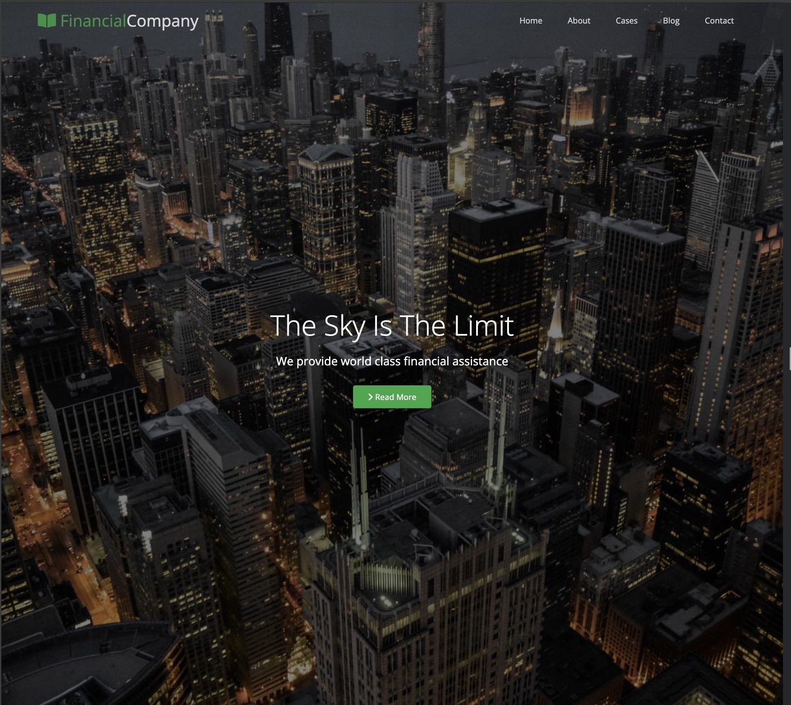
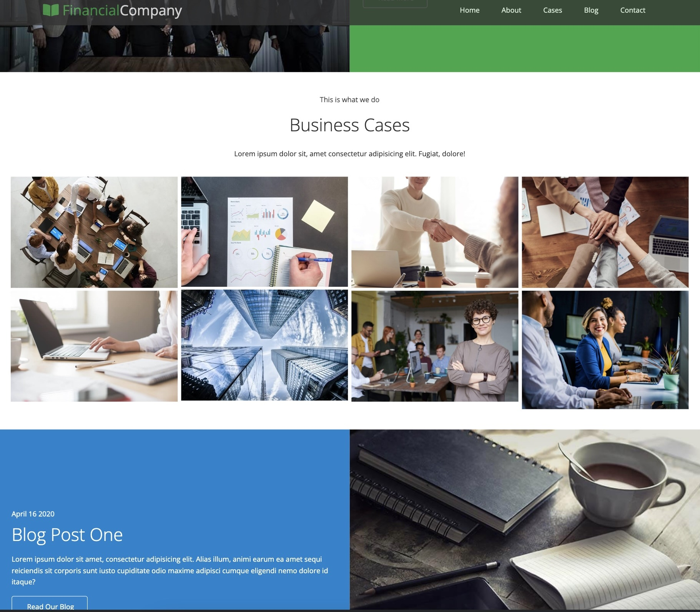
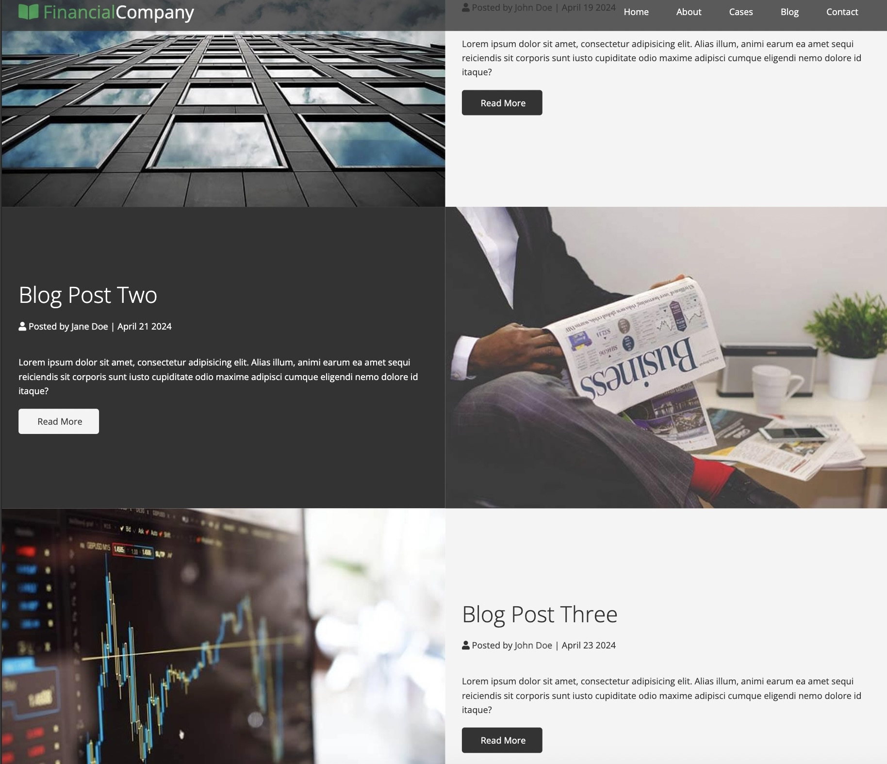

# Financial Company Website

This repository contains the code for a webpage designed for a financial company. It utilizes HTML and CSS technologies to create a professional and visually appealing website. The webpage includes sections for a blog, gallery, and contacts.

## Sections

### Blog

The blog section of the website provides insightful articles, news updates, and financial tips. Users can explore various topics related to finance, investments, market trends, and more.

### Gallery

The gallery section showcases images and visuals related to the financial industry. It may include images of office spaces, financial graphs, team members, or other relevant visuals.

### Contacts

In the contacts section, users can find information on how to get in touch with the financial company. This may include contact forms, phone numbers, email addresses, office addresses, and social media links.

## Technologies Used

-   HTML: Used for structuring the content of the webpage.
-   CSS: Utilized for styling and design elements, making the webpage visually appealing and user-friendly.
-   JavaScript: Employed for adding interactivity and dynamic behavior to the webpage, enhancing user experience.

## How to Use

1. Clone this repository to your local machine.
2. Open the project folder in your preferred text editor or IDE.
3. Modify the HTML and CSS files to customize the website according to your requirements.
4. Preview the changes in a web browser to ensure everything looks as expected.
5. Once satisfied with the modifications, deploy the website to your hosting platform of choice.

## Contributors

-   [Your Name](https://github.com/yourusername)
-   [Contributor Name](https://github.com/contributorusername)

## License

This project is licensed under the [MIT License](LICENSE).

